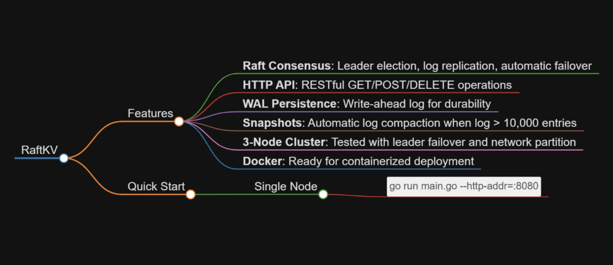

# RaftKV



Distributed key-value store with Raft consensus algorithm, built in Go.

## Features

- **Raft Consensus**: Leader election, log replication, automatic failover
- **HTTP API**: RESTful GET/POST/DELETE operations
- **WAL Persistence**: Write-ahead log for durability
- **Snapshots**: Automatic log compaction when log > 10,000 entries
- **3-Node Cluster**: Tested with leader failover and network partition
- **Docker**: Ready for containerized deployment

## Quick Start

### Single Node
```bash
go run main.go --http-addr=:8080
```

### 3-Node Cluster
```bash
# Terminal 1 (Node 1)
go run main.go --http-addr=:8080 --raft-addr=:12000 --data-dir=./data1 --node-id=node1 --peers=node2:localhost:12001,node3:localhost:12002

# Terminal 2 (Node 2)
go run main.go --http-addr=:8081 --raft-addr=:12001 --data-dir=./data2 --node-id=node2 --peers=node1:localhost:12000,node3:localhost:12002

# Terminal 3 (Node 3)
go run main.go --http-addr=:8082 --raft-addr=:12002 --data-dir=./data3 --node-id=node3 --peers=node1:localhost:12000,node2:localhost:12001
```

### Test It
```bash
# Write to leader
curl -X POST http://localhost:8080/kv/hello -d '{"value":"world"}'

# Read from any node (leader or follower)
curl http://localhost:8080/kv/hello
curl http://localhost:8081/kv/hello
curl http://localhost:8082/kv/hello
```

## Architecture

```
┌─────────┐     ┌─────────────┐     ┌───────────┐     ┌─────────┐
│ Client  │────▶│ HTTP Server │────▶│ RaftStore │────▶│Raft Node│
└─────────┘     └─────────────┘     └───────────┘     └────┬────┘
                                                            │
                       ┌──────────────┬─────────────────────┘
                       ▼              ▼
                  ┌─────────┐    ┌──────────┐
                  │   WAL   │    │ In-Mem   │
                  │         │    │ Store    │
                  └─────────┘    └──────────┘
                              │
                              ▼
                        ┌──────────┐
                        │ Snapshot │
                        │  File    │
                        └──────────┘
```

## Tech Stack

- Go 1.21+
- Custom Raft consensus implementation
- HTTP REST API
- Docker & Docker Compose

## Project Structure

| Directory | Purpose |
|-----------|---------|
| `raft/` | Raft consensus engine |
| `server/` | HTTP API handlers |
| `store/` | In-memory KV + WAL |
| `tools/` | Benchmark utilities |
| `deploy/` | Deployment scripts |

## Benchmarks (Real Results)

Tested on localhost with 3-node cluster, 20 concurrent workers, 5,000 operations each.

| Operation | Target Node | Throughput | Latency | Errors |
|-----------|-------------|------------|---------|--------|
| Write | Leader (8080) | 3,203 ops/sec | 0.31 ms | 0 |
| Read | Leader (8080) | 2,243 ops/sec | 0.45 ms | 0 |
| Read | Follower (8081) | 1,806 ops/sec | 0.55 ms | 0 |

### Run Benchmarks
```bash
# Write benchmark (leader only)
go run tools/bench.go --addr=http://localhost:8080 --workers=20 --ops=5000 --mode=write

# Read benchmark (any node)
go run tools/bench.go --addr=http://localhost:8081 --workers=20 --ops=5000 --mode=read

# Mixed read+write (leader)
go run tools/bench.go --addr=http://localhost:8080 --workers=20 --ops=5000 --mode=mixed
```

## What Works

| Feature | Status | Notes |
|---------|--------|-------|
| 3-node cluster | ✅ Working | Tested locally |
| Leader election | ✅ Working | Automatic |
| Log replication | ✅ Working | All nodes consistent |
| Reads on any node | ✅ Working | Eventual consistency |
| Leader failover | ✅ Tested | Kill leader, new leader elected in ~2s |
| Network partition (2 nodes) | ✅ Tested | Cluster survives 1 node loss |
| Snapshots | ✅ Implemented | Auto at 10,000 entries |
| Metrics endpoint | ✅ Active | Request latency & throughput tracking |
| Production deploy | 🔄 In progress | Docker ready, cloud deploy planned |

## License

MIT